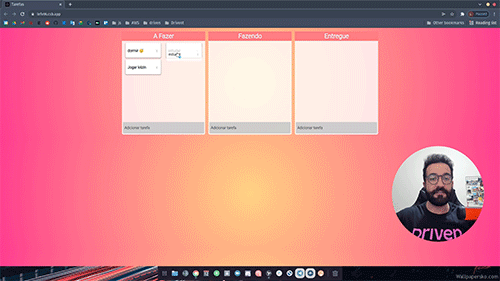

<h1 align="center">
    
</h1>

<h4 align="center"> 
	🚧 Driven Challenge Kanban 🚀
</h4> 

### 💻 Sobre o projeto

- Desenvolver um kanban de tarefas com html, css e javascript.
- Utilizar o template do layout a seguir para construir.

  

- O fluxo da aplicação é a seguinte:

  

### 🛠 Construindo 

- estrutura em html
- estilização em css
- google font com @import
- lógica em javascript: adicionar tarefa
- lógica em javascript: remover tarefa
- lógica em javascript: arrastar tarefa entre os quadros

### 😯 Finalizado 

- Terminamos o terceiro desafio da driven. Nessa última tarefa foi utilizado recursos mais interessantes do javascript, manipulando com movimentos alguns elementos de tela.

  
  

### 🧭 Adicionado

- Editando os elementos html para tags semânticas
- Utilizando medidas fluídas ao invés de medidas fixas
- Mobile first

### 💻 Próximo passo

- localStorage das tarefas

---  

Feito com ❤️ por Douglas A B Novato 👋🏽 [Entre em contato!](https://www.linkedin.com/in/douglasabnovato/)